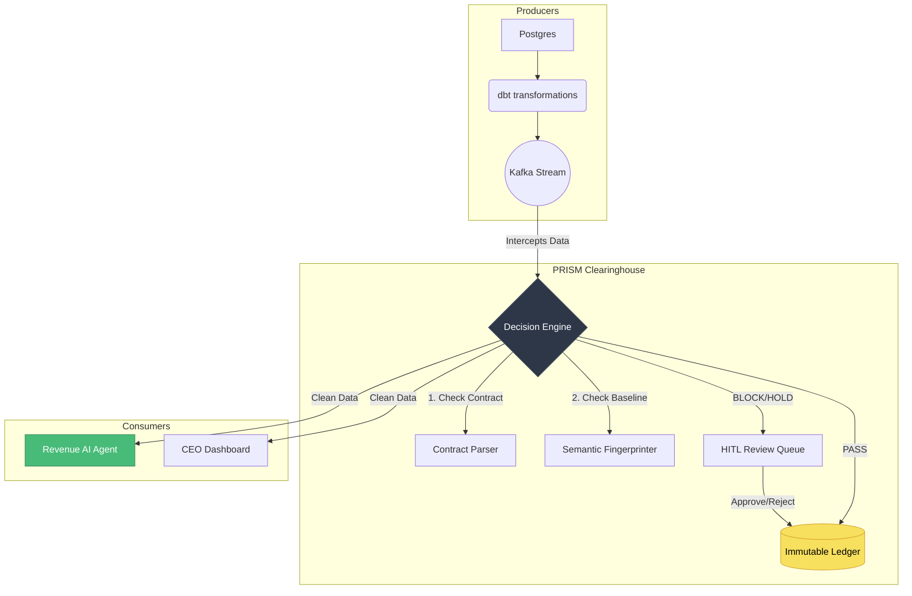

<div align="center">
  <h1>🔷 PRISM</h1>
  <p><b>The Semantic Data Clearinghouse for AI Agents</b></p>

  <p>
    <a href="https://python.org"></a>
    <a href="https://duckdb.org"></a>
    <a href="https://streamlit.io"></a>
    
  </p>
</div>

---

## 🛑 The Problem: Semantic Data Drift

AI agents making pricing, demand, or supply-chain decisions are only as reliable as the data they consume. In production, modern data pipelines rarely crash. Instead, they **silently succeed with the wrong information**.

* A upstream engineer changes a `revenue` column from dollars to cents.
* An API casually drops a currency conversion.
* A timezone shift accidentally includes cancelled orders in a demand signal.

Basic SQL null-checks and row-counts pass. **The pipeline stays green.** But the *semantic meaning* of the data has changed. An AI pricing agent acting on this drifted data will confidently hallucinate a disastrous business decision. 

**Data pipelines lack a Layer 3 (Runtime Semantic Enforcement) gate.** 

---

## 🔷 The Solution: Prism

Prism is the enforcement layer that sits between your messy operational data pipelines and your high-stakes AI agents. 

It verifies semantic correctness in real-time, blocks corrupted data before it reaches a decision model, and logs every event with an immutable, cryptographically secure audit trail.

### Key Features
* 🧠 **Semantic Fingerprinting:** Computes a lightweight, deterministic statistical vector of your data's true meaning (mean, variance, null rates). It detects semantic drift mathematically, without heavy ML training.
* 📜 **LLM-Powered Data Contracts:** Define constraints in plain English (*"Revenue must be in USD and non-negative"*). Prism compiles this into executable rules.
* 🚦 **Confidence-Gated Routing:** Automatically PASSes clean data, HOLDs ambiguous data for human review, and BLOCKs clear contract violations.
* 🧑‍⚖️ **Human-in-the-Loop (HITL):** A secure Command Center where data stewards can review quarantined data, approving or rejecting with a full accountability trail.
* 🏦 **Immutable Ledger:** Every decision (AI and Human) is appended to a DuckDB ledger for SOX/GDPR compliance.

---

## 🏗 Architecture



---

## 🚀 Quick Start (The Chaos Demo)

The best way to understand Prism is to see it catch a silent pipeline failure. 
The included demo generates perfectly clean revenue data, establishes a baseline, and then injects semantic chaos.

### 1. Installation
```bash
git clone https://github.com/WORTHOX/PRISM.git
cd PRISM

python -m venv .venv
source .venv/bin/activate
pip install -r requirements.txt
```

*(Optional) To enable AI-powered root-cause analysis and natural language contract parsing:*
```bash
cp .env.example .env
# Open .env and add your GEMINI_API_KEY
```

### 2. Run the Chaos Pipeline
```bash
# First Run: Prism establishes the statistical baseline (PASS)
python demo/pipeline.py

# Chaos Mode A: Revenue is silently divided by 30 (monthly -> daily ARR)
python demo/pipeline.py unit_flip

# Chaos Mode B: Inject 40% NULL values
python demo/pipeline.py null_injection

# Chaos Mode C: Revenue flips negative
python demo/pipeline.py sign_flip
```

### 3. Launch the Command Center
```bash
streamlit run ui/dashboard.py
```
Open `http://localhost:8501` to view:
* **The Live Dashboard:** Real-time pass/hold/block telemetry.
* **The Review Queue:** Approve or reject the chaos data you just generated.
* **The Audit Ledger:** View the immutable history of all pipeline events.

---

## 🛠 Tech Stack
* **Language:** Python 3.10+
* **Data Processing:** Pandas, NumPy
* **Audit Ledger:** DuckDB
* **UI / Dashboard:** Streamlit
* **AI Engine:** Google Gemini 2.0 Flash

---

## 💡 Designed for Enterprise Reliability
Prism is built for environments where data integrity and compliance cannot be compromised. It provides the necessary infrastructure to operate autonomous systems with full confidence, ensuring the underlying data feeds are actively verified for semantic truth.
